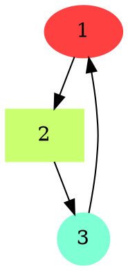
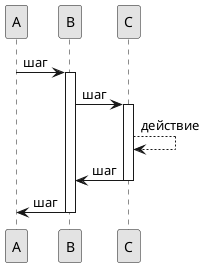

## Языки описания диаграмм

Как и в случае текста, языки описания графических материалов позволяют легко вносить и отслеживать изменения в рисунок. Еще одним преимуществом таких языков является возможность автоматизации построения рисунков. Это касается, в частности, построения различных диаграмм на основе автоматического анализа классов и модулей из программного кода.

Одним из наиболее популярных инструментов в этой области является Graphviz, в котором для описания графов различного вида используется язык Dot.

Пример кода на языке Dot показан далее:

Результат компиляции в графический файл представлен на @fig:docs6.

{#fig:docs6}

Еще одним популярным инструментом является PlantUML, предназначенный для создания как UML-диаграмм различного вида, так и для диаграмм иного вида (диаграммы Ганта, интеллект-карты и проч.).

Ниже представлен пример диаграммы, описанной на языке PlantUML:

Результат компиляции в графический файл представлен на @fig:docs7.

{#fig:docs7}
