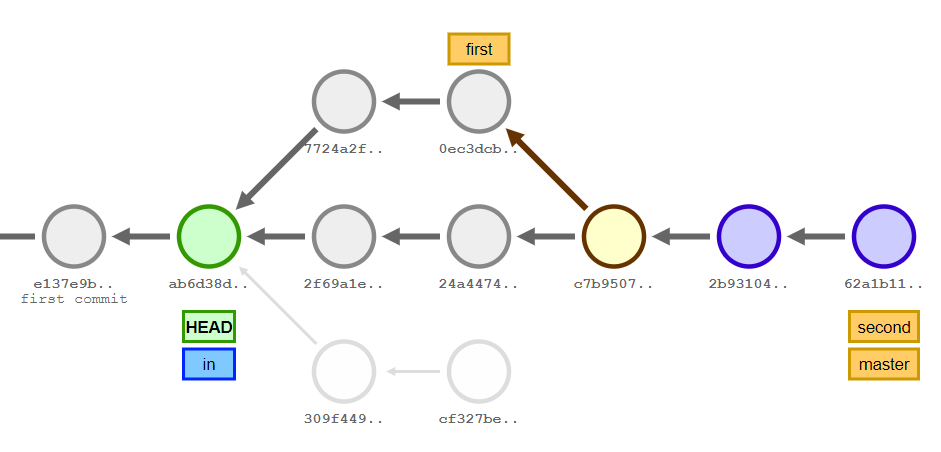

# Практическое задание №5. Системы контроля версий

П.Н. Советов, РТУ МИРЭА

Работа с Git.

## Задача 1

На сайте https://onlywei.github.io/explain-git-with-d3 или http://git-school.github.io/visualizing-git/ (цвета могут отличаться, есть команды undo/redo) с помощью команд эмулятора git получить следующее состояние проекта (сливаем master с first, перебазируем second на master): см. картинку ниже. Прислать свою картинку.



## Задача 2

Создать локальный git-репозиторий. Задать свои имя и почту (далее – coder1). Разместить файл prog.py с какими-нибудь данными. Прислать в текстовом виде диалог с git.

## Задача 3

Создать рядом с локальным репозиторием bare-репозиторий с именем server. Загрузить туда содержимое локального репозитория. Команда git remote -v должна выдать информацию о server! Синхронизировать coder1 с server.

Клонировать репозиторий server в отдельной папке. Задать для работы с ним произвольные данные пользователя и почты (далее – coder2). Добавить файл readme.md с описанием программы. Обновить сервер.

Coder1 получает актуальные данные с сервера. Добавляет в readme в раздел об авторах свою информацию и обновляет сервер.

Coder2 добавляет в readme в раздел об авторах свою информацию и решает вопрос с конфликтами.

Прислать список набранных команд и содержимое git log.

Пример лога коммитов:

```
*   commit a457d748f0dab75b4c642e964172887de3ef4e3e
|\  Merge: 48ce283 d731ba8
| | Author: Coder 2 <coder2@corp.com>
| | Date:   Sun Oct 11 11:27:09 2020 +0300
| | 
| |     readme fix
| | 
| * commit d731ba84014d603384cc3287a8ea9062dbb92303
| | Author: Coder 1 <coder1@corp.com>
| | Date:   Sun Oct 11 11:22:52 2020 +0300
| | 
| |     coder 1 info
| | 
* | commit 48ce28336e6b3b983cbd6323500af8ec598626f1
|/  Author: Coder 2 <coder2@corp.com>
|   Date:   Sun Oct 11 11:24:00 2020 +0300
|   
|       coder 2 info
| 
* commit ba9dfe9cb24316694808a347e8c36f8383d81bbe
| Author: Coder 2 <coder2@corp.com>
| Date:   Sun Oct 11 11:21:26 2020 +0300
| 
|     docs
| 
* commit 227d84c89e60e09eebbce6c0b94b41004a4541a4
  Author: Coder 1 <coder1@corp.com>
  Date:   Sun Oct 11 11:11:46 2020 +0300
  
      first commit
```

## Задача 4

Написать программу на Питоне (или другом ЯП), которая выводит список содержимого всех объектов репозитория. Воспользоваться командой "git cat-file -p". Идеальное решение – не использовать иных сторонних команд и библиотек для работы с git.

## Полезные ссылки

Git

Учебник (рус.): https://git-scm.com/book/ru/v2

Шпаргалка (рус.): https://training.github.com/downloads/ru/github-git-cheat-sheet/

Официальная документация: https://git-scm.com/docs

Эксцентричный доклад Л. Торвальдса о Git: https://www.youtube.com/watch?v=4XpnKHJAok8

Дерево Меркла: http://cryptowiki.net/index.php?title=Дерево_Merkle

Git for Windows: https://git-scm.com/download/win

Репозиторий chibicc: https://github.com/rui314/chibicc.git

Игра по git: https://learngitbranching.js.org/?locale=ru_RU

SHA-1

Описание алгоритма: https://ru.wikipedia.org/wiki/SHA-1

Вероятность хеш-коллизии: https://preshing.com/20110504/hash-collision-probabilities/

https://ru.m.wikipedia.org/wiki/Парадокс_дней_рождения

https://security.googleblog.com/2017/02/announcing-first-sha1-collision.html
