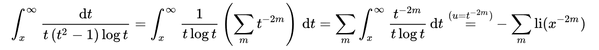
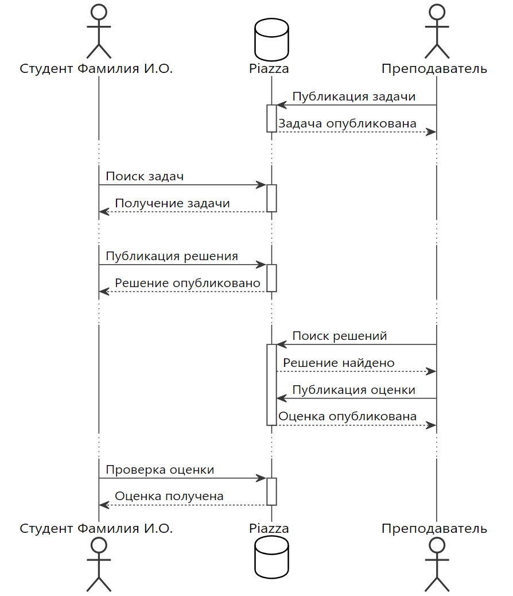

# Практическое занятие №7. Генераторы документации

П.Н. Советов, РТУ МИРЭА

## Задача 1

Реализовать с помощью математического языка LaTeX нижеприведенную формулу:

Прислать код на LaTeX и картинку-результат, где, помимо формулы, будет указано ФИО студента.

## Задача 2

На языке PlantUML реализовать диаграмму на рисунке ниже. Прислать текст на PlantUML и картинку-результат, в которой ФИО студента заменены Вашими собственными.
Обратите внимание на оформление, желательно придерживаться именно его, то есть без стандартного желтого цвета и проч. Чтобы много не писать используйте псевдонимы с помощью ключевого слова "as".

Используйте [онлайн-редактор](https://plantuml-editor.kkeisuke.com/).

## Задача 3

Описать какой-либо алгоритм сортировки с помощью noweb. Язык реализации не важен. Прислать nw-файл, pdf-файл и файл с исходным кодом. В начале pdf-файла должно быть указано ваше авторство. Добавьте, например, где-то в своем тексте сноску: \footnote{Разработал Фамилия И.О.}
Дополнительное задание: сравните "грамотное программирование" с Jupyter-блокнотами (см. https://github.com/norvig/pytudes/blob/master/ipynb/BASIC.ipynb), опишите сходные черты, различия, перспективы того и другого.

## Задача 4

Выбрать программный проект из нескольких файлов (лучше свой собственный), состоящий из нескольких файлов. Получить для него документацию в Doxygen. Язык реализации не важен. Должны быть сгенерированы: описания классов и функций, диаграммы наследования, диаграммы графа вызовов функции. Прислать pdf-файл с документацией (см. latex/make.bat), в котором будет указано ваше авторство. Необходимо добиться корректного вывода русского текста.
 
## Задача 5

Выбрать программный проект на Python (лучше свой собственный), состоящий из нескольких файлов. Получить для него документацию в Doxygen. Должны быть сформированы: руководство пользователя и руководство программиста. Руководство программиста должно содержать описание API, полученное с использованием расширения autodoc. Для каждого из модулей должна присутствовать диаграмма наследования и подробное описание классов и функций (назначение, описание параметров и возвращаемых значений), извлеченных из docstring. Прислать pdf-файл с документацией, в котором будет указано ваше авторство и весь авторский текст приведен на русском языке.

## Полезные ссылки

**LaTeX**

http://grammarware.net/text/syutkin/TextInLaTeX.pdf

https://grammarware.net/text/syutkin/MathInLaTeX.pdf

https://www.overleaf.com/learn/latex/Learn_LaTeX_in_30_minutes

https://www.overleaf.com/learn/latex/XeLaTeX

**Noweb**

https://www.pbr-book.org/3ed-2018/Introduction/Literate_Programming

https://www.cs.tufts.edu/~nr/noweb/

**Doxygen**

https://www.doxygen.nl/index.html

https://habr.com/ru/post/252101/

**Sphinx**

https://www.sphinx-doc.org/en/master/

https://sphinx-ru.readthedocs.io/ru/latest/index.html

https://breathe.readthedocs.io/en/latest/

**PlantUML**

https://plantuml.com/ru/

https://pdf.plantuml.net/PlantUML_Language_Reference_Guide_ru.pdf

**Mermaid**

https://mermaid.js.org/

https://mermaid.live/edit
