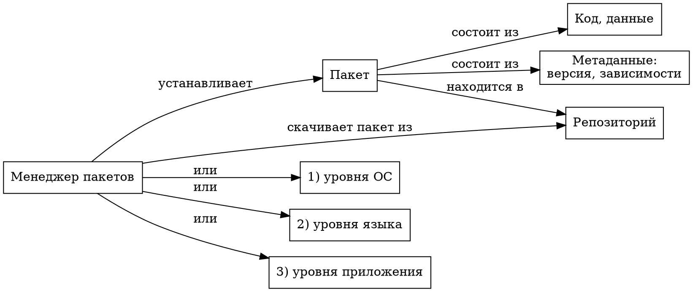

<!-- .slide: data-background="black" style="color:#00ff00" -->

## Конфигурационное управление

Лекция №3. Менеджеры пакетов

Лектор: *Советов Пётр Николаевич*

---

## Пакеты и менеджеры пакетов

---

## ДЗ №2

<pre style="font-size:50%">
Менеджер пакетов    Репозиторий                     Формат
------------------  ------------------------------  ---------------
pip                 pypi.org/pypi/{name}/json       JSON
npm                 registry.npmjs.org/{name}       JSON
Maven               repo1.maven.org/maven2          XML, pom-файл
NuGet               api.nuget.org/v3                XML
apk                 dl-cdn.alpinelinux.org/alpine/  APKINDEX.tar.gz
apt                 archive.ubuntu.com/ubuntu/      Packages.gz
</pre>

---

## Менеджер пакетов в Ubuntu

* apt, deb.
* sources.list.
* Однострочник: как получить адрес репозитория.
* https://wiki.debian.org/PackageManagement

---

## Визуализатор зависимостей для Packages.gz

* Репозитории main и universe.
* Алгоритм обхода в ширину и без рекурсии.
* Утилита graphviz и язык dot.

---

## SAT-решатели и разрешение зависимостей

$$
(x \lor \neg y) \land (\neg x \lor y)
$$

* Задачи из классов P, NP-полные и NP-трудные.
* Кролики и фазаны.
* Задача из практики №2.
* Минимизация зависимостей.
