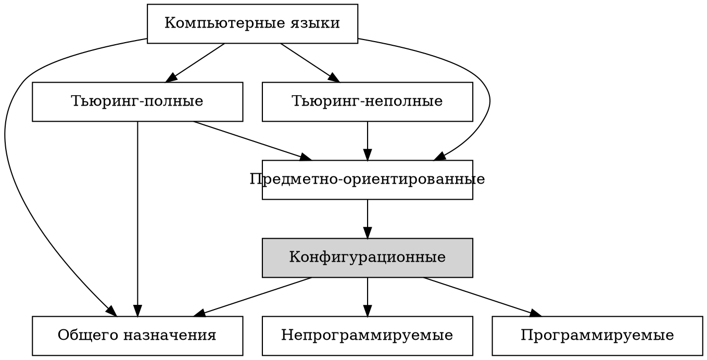

<!-- .slide: data-background="black" style="color:#00ff00" -->

## <span style="color:#00ff00">Конфигурационное управление</span>

Лекция №4. Конфигурационные языки

Лектор: *Советов Пётр Николаевич*

---

## Компьютерные языки



---

## Как описать язык

* **Синтаксис**.
* Семантика.
* Прагматика.

Синтаксис с помощью грамматики:

1. регулярная,
1. контекстно-свободная.

---

## Регулярная грамматика

1. Пусто или одиночный символ.
1. Повторение: `r*`.
1. Последовательность: `r1 r2`.
1. Альтернатива: `r1 | r2`.

Какая связь с регулярными выражениями?

Как описать язык `((((...))))`?

Знаменитый [вопрос](https://stackoverflow.com/questions/1732348/regex-match-open-tags-except-xhtml-self-contained-tags
) со stackoverflow.

---

## Контекстно-свободные грамматики

Добавим к регулярной грамматике рекурсию!

* Железнодорожные диаграммы и БНФ: http://www.json.org/json-ru.html
* Lark: https://www.lark-parser.org/ide/

---

## Разбор мини-версии Лого

```
to square
  repeat 4 [fd 100 rt 90]
end

repeat 20 [square rt 20]
```

* https://calormen.com/jslogo/
* https://deepakjois.github.io/hs-logo/examples.html

---

## Разбор S-выражений

```
(define square
  (lambda (x) (* x x)))
```

* https://try.scheme.org/
* http://norvig.com/lispy.html

---

## Разбор языка Conf

```
# comment
vm = {
    ip = [192 168 44 44]
    memory = 1024
    synced_folders = [{
        host_path = "data/"
        guest_path = "/var/www"
        type = "default"
    }]
}
log = "conf.log"
```

---

## Разбор регулярных выражений

Однозначность грамматики.

Приоритеты:

1. Скобки.
1. Повторение.
1. Последовательность.
1. Альтернатива.

---

## Библиотека peco

* https://github.com/true-grue/peco
* Conf на peco: https://github.com/true-grue/peco/blob/main/test_conf.py